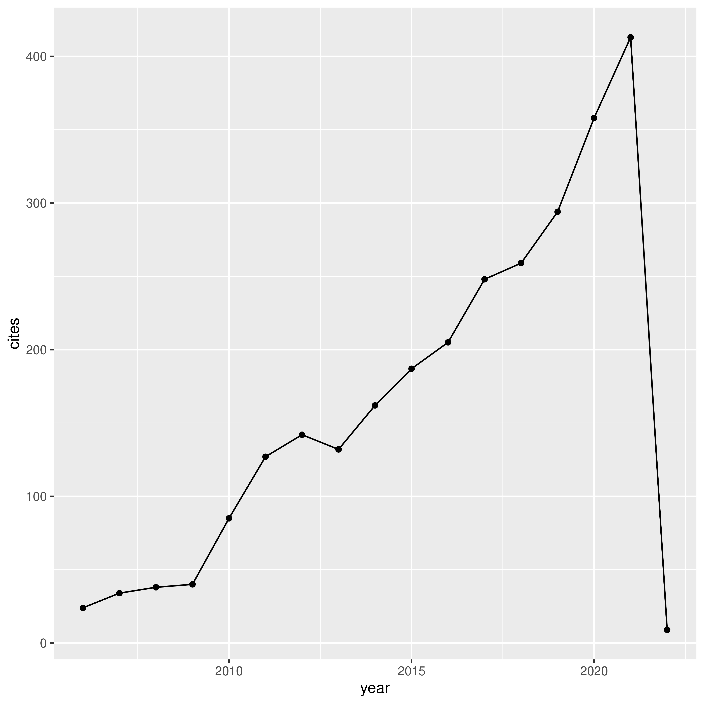
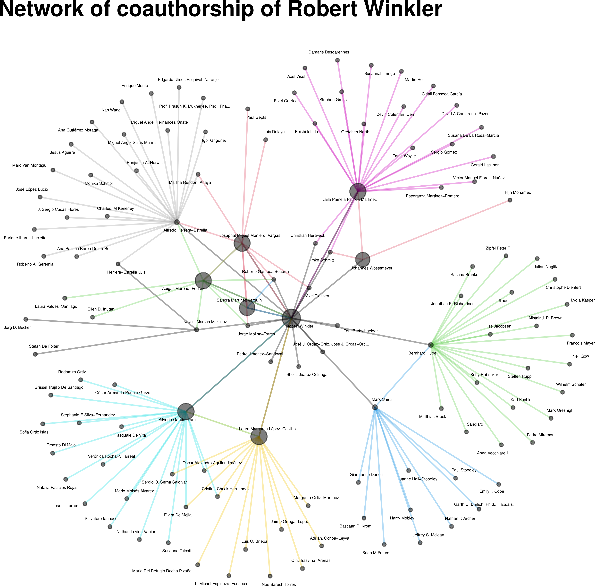

# citation-analysis-google-scholar-R
R script for analyzing Google Scholar profiles

The `R` script is using the `scholar` package as published at <https://cran.r-project.org/web/packages/scholar/>.

The most important variable is the Google Scholar profile ID.

In my case, this ID is `fyMS1UQAAAAJ`, obtained from the URL `https://scholar.google.com.mx/citations?hl=de&user=fyMS1UQAAAAJ&view_op=list_works&sortby=pubdate`

# Motivation

For analyzing my bibliographic impact and the types of papers which are most cited by the readers, I first tried to install Harzig's Publish or Perish (<https://harzing.com/resources/publish-or-perish/>) on Linux; using Wine, PlayOnLinux etc. To make a long story short: I gave up and looked for a possibility to retrieve data from Google Scholar and analyzing them with the statistical and graphics language `R` (<https://www.r-project.org>).

This workflow has the additional advantage that custom function, such as the comparison of various researchers of an institute, or additional statistical functions, can be easily implemented.

# General information about author

The script reports the general information, such as name, affiliation, H-factor and i10.

# Analysis of citations over time

Of course, one wants to know, which types of papers are most cited. The script calculates cites/year and produces a `.csv` file with the numeric analysis and bibliographic information:

| cites_year  	   |   pubs_clean...year...	| pubs_clean...cites...	 | pubs_clean...title...  |
| ---------------  | ---------------------- | ---------------------  | --------------------- |
| 16.3076923076923 | 	2009	                | 212	                   | Production of Pyomelanin, a Second Type of Melanin,.. | 
| 17.5454545454545 |  2011	                | 193	                   | Comparative and functional genomics provide insights ..|
| 11.6923076923077 |	2009	                | 152	                   | A novel immune evasion strategy of Candida albicans .. |

This files can be further evaluated, e.g. in LibreOffice or MS EXCEL.

# Citation graph

Well, you also can copy the graph from Google Scholar. But the `R` graphs may be customized.

# Network analysis

The network analysis reports the relationships between co-publishing authors:

# Contact
<mailto:robert.winkler@cinvestav.mx>
